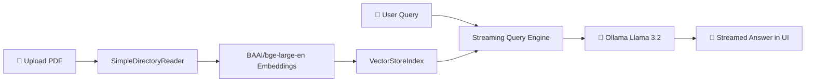

# 📄 Document Chat RAG (Retrieval-Augmented Generation)

An end-to-end, privacy-first **Retrieval-Augmented Generation (RAG)** web application that enables you to chat with your local documents using **Llama 3.2 via Ollama**, **LlamaIndex**, and **Streamlit**.

---

## 🚀 Key Features

* **🔒 100% Local & Private:** Runs entirely on your local machine using Ollama — your document data never leaves your computer.
* **⚡ High-Quality Embeddings:** Uses `BAAI/bge-large-en-v1.5` dense embeddings for precise semantic retrieval.
* **💬 Real-Time Streaming Responses:** Answers stream in real-time as they are synthesized by the LLM.
* **📑 Interactive PDF Preview:** Side-by-side view with an embedded PDF preview pane directly inside the application.
* **🧠 Context-Aware QA Prompting:** Custom step-by-step reasoning prompt template with built-in fallback guardrails.
* **↺ One-Click Session Reset:** Easily clear conversation history and cache with the reset button.

---

## 🏗️ Architecture & Pipeline



1. **Document Ingestion:** The uploaded PDF is saved to a secure temporary directory and loaded using LlamaIndex's `SimpleDirectoryReader`.
2. **Embedding & Indexing:** Document chunks are vectorized using Hugging Face's `bge-large-en-v1.5` embedding model and indexed in an in-memory vector store.
3. **Query Engine:** The query engine retrieves top relevant context chunks and synthesizes streaming responses with Ollama (`llama3.2`).
4. **Interactive UI:** Rendered with Streamlit with split-pane layout for PDF preview and conversational chat.

---

## 🛠️ Tech Stack

* **LLM Engine:** [Ollama](https://ollama.com/) (Llama 3.2)
* **RAG Framework:** [LlamaIndex](https://www.llamaindex.ai/) (`llama-index-core`, `llama-index-llms-ollama`, `llama-index-embeddings-huggingface`)
* **Embedding Model:** `BAAI/bge-large-en-v1.5`
* **Frontend / UI:** [Streamlit](https://streamlit.io/)
* **Language:** Python 3.11+

---

## 📦 Getting Started

### 1. Prerequisites: Install & Run Ollama

1. Download and install Ollama from **[ollama.com](https://ollama.com/download)**.
2. Pull the **Llama 3.2** model:
   ```bash
   ollama pull llama3.2
   ```
3. Verify that the Ollama service is running:
   ```bash
   ollama list
   ```

---

### 2. Clone the Repository & Install Dependencies

```bash
cd document-chat-rag
pip install -r requirements.txt
```

---

### 3. Run the Streamlit Application

```bash
streamlit run app.py
```

The app will open automatically in your browser at `http://localhost:8501`.

---

## 📂 Project Structure

```
document-chat-rag/
├── app.py                             # Main Streamlit application & RAG query engine
├── requirements.txt                   # Python dependencies
├── SETUP.md                           # Detailed Windows & setup guide
├── README.md                          # Project documentation
├── AI_Feature_Suggestions_Roadmap.pdf # AI enhancements & feature roadmap
├── main_self_hosted_vectorDB.ipynb    # Vector DB exploration notebook (Qdrant)
└── rag_demo.ipynb                     # Basic RAG walkthrough notebook
```

---

## 🗺️ AI Features & Implementation Roadmap

A comprehensive roadmap of recommended features is documented in **[AI_Feature_Suggestions_Roadmap.pdf](AI_Feature_Suggestions_Roadmap.pdf)**:

* **Phase 1 (Quick Wins):** One-click document summaries, auto-generated starter prompts, and page citation snippets.
* **Phase 2 (Core Upgrades):** Persistent vector database (Qdrant), multi-document uploads, and cross-encoder reranking.
* **Phase 3 (Advanced AI):** Multimodal OCR/Vision parsing, agentic tool calling (web search, Python interpreter), and voice interaction.

---

## 👤 Author

**Madan Sai Jogi**
* GitHub: [@madhan-4413](https://github.com/madhan-4413)
* LinkedIn: [madhan-sai-8b1a29341](https://www.linkedin.com/in/madhan-sai-8b1a29341/)

---

## 📄 License

This project is licensed under the MIT License — feel free to customize and extend for your own RAG applications!
